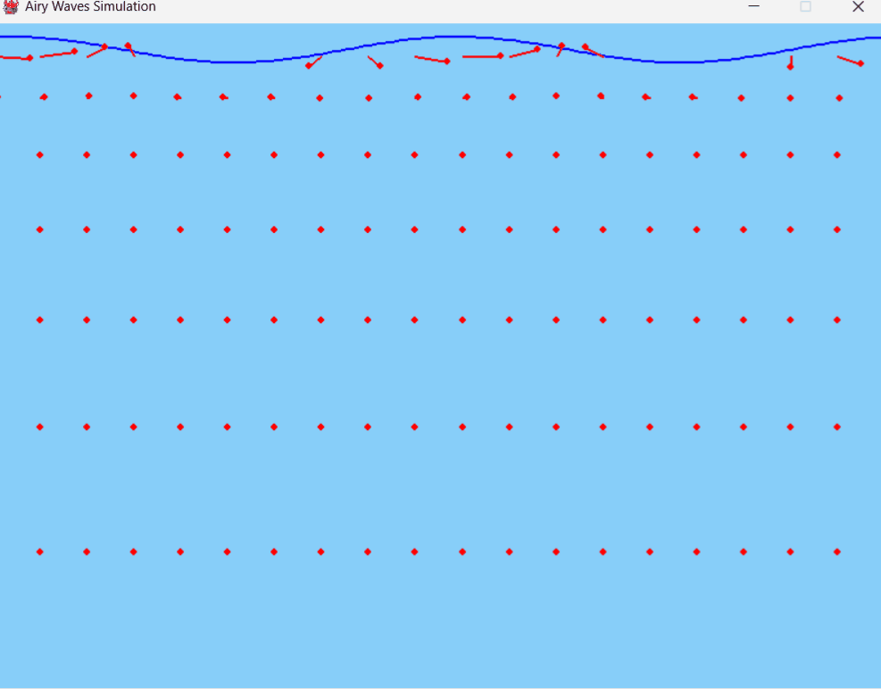

# Airy Waves 1D

A Python implementation of a one-dimensional Airy wave simulation based on linear wave theory. This simulation computes the free-surface elevation and near-surface velocity field of a wave defined by:

\[
\eta(x,t) = a \cos(kx - \omega t)
\]

with the dispersion relation:

\[
\omega = \sqrt{g\,k\,\tanh(kh)}
\]




## Installation

Ensure you have Python 3.7+ installed. Then, install the package using this command:

```bash
pip install -e .
```

## Usage

Run the simulation via the main entry point:

```bash
python main.py [options]
```

You can customize parameters using the following options:

- **--amplitude**  
  Wave amplitude (default: 1.0).

- **--wavelength**  
  Wavelength of the wave (default: 10.0).

- **--water_depth**  
  Water depth (default: 50.0).

- **--gravity**  
  Gravitational acceleration (default: 9.81).

- **--dt**  
  Time step for the simulation in seconds (default: 0.1).

- **--duration**  
  Total simulation duration in seconds (default: 10.0; use 0 for infinite).

### Visualization Options

- **--width**  
  Window width in pixels (default: 800).

- **--height**  
  Window height in pixels (default: 600).

- **--arrow_scale**  
  Scaling factor for velocity arrows (default: 0.5).

- **--grid_x**  
  Number of grid points in the x direction for the velocity field (default: 20).

- **--grid_y**  
  Number of grid points in the y direction for the velocity field (default: 10).

- **--fps**  
  Frames per second (default: 60).

